# Djoppie-Hive Architecture - Mermaid Diagrams

## 1. Role Hierarchy (Graph)

```mermaid
graph TD
    A["👑 System Admin<br/>Full Access"] --> B["🔒 HR Manager<br/>Department Admin"]
    A --> C["📊 HR Coordinator<br/>Edit & Manage"]
    B --> D["👤 HR Specialist<br/>Limited Edit"]
    C --> D
    D --> E["👁️ Viewer<br/>Read Only"]
    A --> F["👤 Self-Service User<br/>Own Data Only"]
```

## 2. Authentication Flow (Sequence)

## 3. Authorization Decision Tree

```mermaid
graph TD
    A["🔐 API Request Received"] --> B{"Has Bearer Token?"}
    B -->|NO| C["401 Unauthorized"]
    B -->|YES| D["Validate Token Signature"]
    D --> E{"Signature Valid?"}
    E -->|NO| F["401 Unauthorized"]
    E -->|YES| G["Extract Claims"]
    G --> H["Load User & Roles from DB"]
    H --> I{"User Found?"}
    I -->|NO| J["403 Forbidden"]
    I -->|YES| K{"Endpoint Requires Role?"}
    K -->|NO| L["Check Row-Level Security"]
    K -->|YES| M{"User Has Role?"}
    M -->|NO| N["403 Forbidden"]
    M -->|YES| L
    L --> O{"Can Access Resource?"}
    O -->|NO| P["404 Not Found"]
    O -->|YES| Q["✅ Execute Endpoint"]
    Q --> R["Audit Log Event"]
    R --> S["Return 200 OK + Data"]
```

## 4. User Groups & Distribution Groups

## 5. Database Relationships (RBAC)

## 6. API Authorization Attributes

```mermaid
graph TD
    A["GET /api/employees"] --> B["[Authorize]"]
    B --> C{"Endpoint<br/>Authorization"}
    C -->|"[Authorize(Roles='HR.Manager,HR.Coordinator')]"| D["Only these roles"]
    C -->|"[Authorize(Policy='DepartmentAccess')]"| E["Custom policy check"]
    C -->|"[AllowAnonymous]"| F["No auth required"]
    
    D --> G["Token has required role?"]
    E --> H["Custom logic check"]
    F --> I["Allow all"]
    
    G --> J{"✅ YES"}
    G --> K{"❌ NO"}
    H --> J
    H --> K
    I --> L["✅ Proceed"]
    
    J --> M["Audit Log"]
    K --> N["403 Forbidden<br/>+ Audit Log"]
    L --> M
    M --> O["Execute Handler"]
```

## 7. Microsoft Graph Service Principal Flow

## 8. Data Access Control (Row-Level Security)

```mermaid
graph TD
    A["User requests Employee #123"] --> B["Load Employee Record"]
    B --> C{"Check Access Rules"}
    
    C -->|"Role: System Admin"| D["✅ Full Access"]
    C -->|"Role: HR Manager<br/>+ Same Department"| E["✅ Can View & Edit"]
    C -->|"Role: HR Specialist<br/>+ Not Same Dept"| F["❌ 404 Not Found<br/>RLS Hidden"]
    C -->|"Self-Service<br/>+ Own Record"| G["✅ Limited Edit"]
    C -->|"Viewer Role"| H["✅ Read Only"]
    C -->|"Other User<br/>Different Role"| I["❌ 403 Forbidden"]
```

## 9. Token Validation & Claims Pipeline

```mermaid
graph LR
    A["Bearer Token"] --> B["Extract Header"]
    B --> C["Parse JWT"]
    C --> D["Get Public Key<br/>from Entra ID"]
    D --> E["Verify Signature"]
    
    E -->|"Invalid"| F["❌ Reject"]
    E -->|"Valid"| G["Validate Expiration"]
    
    G -->|"Expired"| H["❌ Reject"]
    G -->|"Active"| I["Extract Claims"]
    
    I --> J["oid<br/>upn<br/>roles<br/>scp"]
    J --> K["Load User<br/>from DB"]
    K --> L["Map Groups→Roles"]
    L --> M["✅ Create<br/>ClaimsPrincipal"]
    M --> N["Authorize Endpoint"]
```

## 10. Complete Request Lifecycle

```mermaid
sequenceDiagram
    participant Client as Browser Client
    participant App as React App
    participant API as API Backend
    participant Validator as Token Validator
    participant Handler as Endpoint Handler
    participant DB as Database
    participant AuditLog as Audit Log

    Client->>App: User Action
    App->>App: Check if token expired
    
    alt Token Expired
        App->>App: Silent token refresh
    end
    
    App->>API: HTTP Request + Bearer Token
    
    API->>Validator: Validate Token
    Validator->>Validator: Verify signature
    Validator->>Validator: Check expiration
    Validator->>DB: Load User & Roles
    
    alt Validation Failed
        API-->>App: 401 Unauthorized
    else Validation Success
        Validator->>API: ✅ Claims Principal
        API->>Handler: [Authorize] Check
        
        alt Authorization Failed
            API-->>App: 403 Forbidden
        else Authorization Success
            Handler->>DB: Query Data
            DB-->>Handler: Results (filtered)
            Handler->>Handler: Apply RLS
            Handler->>AuditLog: Log access
            Handler-->>API: Response DTO
            API-->>App: 200 OK + JSON
            App->>Client: Update UI
        end
    end
```

## 11. Environment Comparison

```mermaid
graph LR
    subgraph Dev["🛠️ Development"]
        A["localhost:5173"]
        B["HTTPS: Disabled"]
        C["CORS: Permissive"]
        D["Secrets: User Secrets"]
        E["Auth: Enabled"]
    end
    
    subgraph Prod["🚀 Production"]
        F["azurestaticapps.net"]
        G["HTTPS: Required"]
        H["CORS: Restricted"]
        I["Secrets: Key Vault"]
        J["Auth: Strict"]
    end
    
    A --> B
    A --> C
    A --> D
    A --> E
    
    F --> G
    F --> H
    F --> I
    F --> J
```

## 12. GDPR Compliance Data Lifecycle

---

**Diagram Version**: 1.0  
**Format**: Mermaid (compatible with GitHub, Azure DevOps, GitLab)  
**Note**: Copy these diagrams to render in any Mermaid viewer
